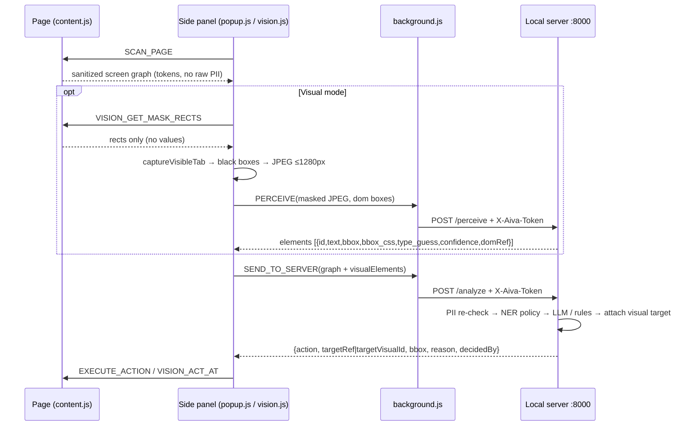
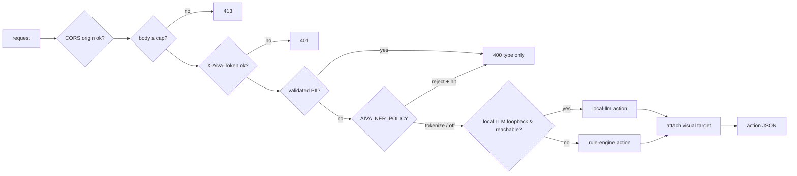

# NEXAIVA / Details — Aiva Nex Agent architecture (extended context)

Read `Intro.md` first. This file is the full reference; every statement maps
to code on branch `dev` (paths given). Secrets live in `Vault.md`.

Contents: §1 Extension internals · §2 Privacy layers · §3 Server routes ·
§4 Vision pipeline · §5 NER design · §6 Config reference · §7 Testing ·
§8 Known limitations

---

## 1. Extension internals (`extension/`, Manifest V3, plain JS, no build)

### 1.1 Components and load order
| Context | Files (load order) | Role |
|---|---|---|
| Content script, every `<all_urls>` page, `document_idle`, top frame only | `memory.js` → `pii-checks.js` → `ner-rules.js` → `content.js` → `vision-content.js` | Order matters: `content.js` uses `detectPII()`/`redactAllPII()` from `pii-checks.js`, which calls the NER rules from `ner-rules.js`. `vision-content.js` only reads rects tagged by `content.js` (`data-pa-ref`). |
| Side panel (`side_panel.default_path = popup.html`) | `memory.js` → `popup.js` → `settings.js` → `vision.js` | UI: scan, JSON preview, send, execute, chat, profile/autofill, feedback, ⚙ Settings, 👁 Visual toggle. |
| Service worker | `background.js` | The **only** code that makes network calls. Opens the side panel on toolbar click. |

Permissions: `activeTab`, `tabs`, `sidePanel`, `storage`; host `<all_urls>`
(needed for the content script and `captureVisibleTab`).

`chrome.storage.local` keys: `aivaServerToken`, `aivaFeedbackOptIn`,
`aivaVisualMode`, `aivaMemory` (per-fact on-device memory, design in
`docs/MEMORY-ARCHITECTURE-PLAN.md`; never sent to the server).

### 1.2 Message flow
| Message | From → To | Handler does |
|---|---|---|
| `SCAN_PAGE` | panel → content.js | `buildScreenGraph()`: fields/buttons/links, tokenise sensitive values, draw redaction overlays, return sanitized graph |
| `SEND_TO_SERVER` | panel → background | `serverFetch("/analyze")` with the graph (+ `visualElements` in Visual mode) |
| `EXECUTE_ACTION` | panel → content.js | `executeAction()`: click / focus / scroll / summarize (+ autofill / fill_single_field / place_order from chat flows, values from local memory only) |
| `VISION_GET_MASK_RECTS` | vision.js → vision-content.js | Rects (no text) of sensitive refs, overlays, password / `cc-*` / `one-time-code` inputs; fresh DOM boxes; viewport; DPR |
| `PERCEIVE` | vision.js → background | `serverFetch("/perceive")` with the masked JPEG |
| `VISION_HIGHLIGHT` / `VISION_ACT_AT` | vision.js → vision-content.js | Purple outline on chosen element / click-focus at bbox centre (`elementFromPoint`) for visual-only targets |
| `CHAT_WITH_SERVER` | panel → background | `serverFetch("/chat")` |
| `GET_MODELS` / `CHECK_AUTH` | panel/settings → background | `serverFetch("/models")` (CHECK_AUTH = "Save & Test Connection") |
| `PING_SERVER` | panel → background | plain `fetch("/health")` (no token needed) |
| `NAVIGATE_TAB` | panel → background | open search URL the *user typed* |
| `SEND_FEEDBACK` | panel → background | refused unless `aivaFeedbackOptIn === true`; then POST to external feedback inbox |

### 1.3 `serverFetch()` and the token
`background.js`: `SERVER_URL = "http://127.0.0.1:8000"`. `serverFetch(path)`
reads `aivaServerToken` from `chrome.storage.local`, adds header
`X-Aiva-Token`, and turns a `401` into a readable "open Settings and paste the
token" error. The token is entered once in ⚙ Settings (`settings.js`) and
never leaves `chrome.storage.local` except in that header to localhost.



---

## 2. Privacy layers — what runs where

| # | Layer | In the browser (before send) | On the server (defence in depth) |
|---|---|---|---|
| 1 | Regex + checksums | `pii-checks.js` `detectPII()` / `redactAllPII()`; `content.js` label hints + field types (password, hidden, OTP) | `pii_checks.py` `find_validated_pii_types()` in `/analyze` and `/chat` → **400** naming only the type |
| 2 | NER (names, addresses) | `ner-rules.js` Indian rule layer inside `redactAllPII()` | `server/ner/` spaCy `en_core_web_sm` + same rules, `enforce_ner_policy()` in `/analyze`, `/chat`; `sanitize_texts()` on OCR text |
| 3 | Vision masking | `vision.js` paints opaque black boxes (4 px pad) on an `OffscreenCanvas` *before* JPEG encode; no rects → no screenshot | `/perceive` masks PII-shaped OCR text as `[EMAIL]`, `[PHONE]`…, then NER; image processed in memory only, never stored or returned |

**Layer 1 details.** Candidates (right shape) are always tokenised by the
extension; the server hard-rejects only *validated* items:
AADHAAR 12 digits, first 2–9, Verhoeff passes · CARD 13–19 digits, Luhn passes ·
PAN `[A-Z]{3}[ABCFGHLJPT][A-Z][0-9]{4}[A-Z]` · PHONE optional +91 then 10
digits starting 6–9 · EMAIL. Validated matches win overlaps (two-pass rule).
`extension/pii-checks.js` and `server/pii_checks.py` are line-for-line
mirrors with shared test vectors — change both, run both suites.
Tokens: `EMAIL_n`, `PHONE_n`, `ID_NUMBER_n`, `CARD_n`, `PERSON_n`,
`ADDRESS_n`, literal `PASSWORD_FIELD`, `OTP_FIELD`, `HIDDEN_FIELD`.

**What the screen graph never contains:** full URL (domain only), link
hrefs (`hrefDomain` only), exact positions (rounded to 5 px), any original
value of a field classified sensitive.

**LLM context allow-list.** `server/main.py` `_build_page_context()` passes
only `pageTitle`, `domain`, `headings`, `textSnippets` to chat LLMs (local or
Gemini). Keep it an explicit allow-list (security invariant).

---

## 3. Server routes (`server/main.py`, binds `127.0.0.1:8000`)

Middleware (`server/security.py`), outermost first: CORS → body cap → token.

| Route | Auth | Body cap | Request | Response |
|---|---|---|---|---|
| `GET /health` | open | — | — | `{"status":"ok"}` |
| `GET /docs`, `/redoc`, `/openapi.json` | open | — | — | API docs (no data) |
| `GET /health/llm` | token | — | — | `{reachable, baseUrl, model}` |
| `GET /models` | token | — | — | `{models:[...], default}` (local LLM `/models`, else configured model) |
| `POST /analyze` | token | 256 KB | `ScreenGraph`: `pageTitle≤500`, `domain≤253`, `headings≤100×500`, `textSnippets≤200×1000`, `forms/inputs/buttons/links≤1000`, `sensitiveItemsCount`, `detectedTypes`, `model`, extra allowed (`visualElements`, `visualSummary`) | `{action: click\|focus\|scroll\|summarize, targetRef?, direction?, summary?, reason, decidedBy: "local-llm:<m>"\|"rule-engine"[+vision], targetVisualId?, bbox?, visualText?}` · **400** validated PII / NER reject |
| `POST /chat` | token | 256 KB | `{message 1–4000, graph?, model?, history≤50}` | `{reply, action: chat_reply\|open_url\|scroll\|summarize\|request_autofill_permission\|request_order_confirmation, url?, suggested_actions?}` · **400** as above |
| `POST /ner/scan` | token | 256 KB | `{text ≤20000}` (dev/debug) | `{spans:[{start,end,type,score,source}], tokenized, engine, elapsedMs}` — raw text never echoed |
| `POST /perceive` | token | **4 MB** (`AIVA_MAX_PERCEIVE_BYTES`) | `{image: base64 JPEG/PNG (masked), domElements?, viewport?, masked?}` | `{elements, summary, imageSize, scaleCss, piiMaskedServerSide, nerMaskedServerSide, timingsMs{decode,ocr,cv,fuse,total}, ocr}` · **400** undecodable image |
| `GET /perceive/health` | token | — | — | `{available, engine, error}` |

Errors: `401` wrong/missing `X-Aiva-Token` (constant-time compare; `OPTIONS`
preflight passes), `413` over cap (Content-Length and streamed), `422`
validation errors **without** the submitted input echoed. CORS: origins from
`AIVA_EXTENSION_ORIGIN` (comma list, `*` refused) plus
`http://localhost:*` / `http://127.0.0.1:*`; methods GET/POST/OPTIONS;
headers `Content-Type`, `X-Aiva-Token`. No request bodies, headers or token
values are logged.

**Decision path (`/analyze`).** `find_raw_pii()` → `enforce_ner_policy()` →
`decide_action()`: `call_local_llm()` (OpenAI-compatible
`/chat/completions` over stdlib `urllib`, temp 0, 20 s timeout; response must
parse and name a known ref) else `decide_action_rules()` (PASSWORD/OTP field →
primary button → next sensitive input → summarize) → `attach_visual_target()`
(`server/vision/decide.py`: maps visual id ↔ DOM ref, adds `bbox`; visual-only
rule if the DOM rules only found "summarize").



**Cloud gate.** `AIVA_ALLOW_CLOUD=1` is required for (a) Gemini fallback in
`/chat` (also needs `GEMINI_API_KEY`; key sent in `x-goog-api-key` header,
not URL) and (b) a non-loopback `LOCAL_LLM_BASE_URL`. Loud warning logged on
start and each cloud call.

---

## 4. Vision pipeline (`server/vision/`, SIH26171)

Browser (`vision.js`): mask rects from `vision-content.js` →
`captureVisibleTab` (PNG) → `OffscreenCanvas` downscale ≤1280 px → black
boxes → JPEG q0.9 (lower blurs glyph gaps) → shows the exact masked image in
the panel → `PERCEIVE`.

Server (`pipeline.perceive()`), all CPU:
1. decode + re-downscale ≤1280 px (`MAX_SIDE`)
2. OCR: RapidOCR (PaddleOCR PP-OCR det+rec as ONNX, ~15 MB in the wheel,
   onnxruntime CPU), `use_cls=False`, `rec_batch_num=1`, recogniser widths
   bucketed to 160 px (`ocr.py`); lines with score <0.5 dropped
3. PII mask on every OCR string (same candidate patterns as `pii_checks.py`)
   then NER (`sanitize_texts`: `NAME_n`/`ADDRESS_n`, or `[NAME]`/`[ADDRESS]`
   under `reject`)
4. OpenCV Canny + rectangle contours → control boxes (`detect.py`)
5. fuse OCR + CV + sanitized DOM boxes (IoU ≥0.3 → `domRef`), classify
   `button · input · checkbox · link (blue ink) · heading · text ·
   masked_sensitive`, label inputs from nearest text, ids `v1…`, `bbox_css`
   via `scaleCss`, cap 150 elements, one-line summary

Models load + warm in a background thread at startup (~4–5 s once).
No learned UI detector (YOLO/OmniParser) — hundreds of MB and seconds per
frame for little gain on forms.

**Latency** (Ryzen 7 7730U, 15 GB RAM, no GPU, Python 3.11, 1280×800):

| Screen | OCR lines | Elements | `/perceive` warm | first request |
|---|---|---|---|---|
| Synthetic form (tests) | 7 | 8 | ~0.42 s | — |
| demo-form scholarship | ~20 | 23 | ~0.75–0.85 s | ~0.85–0.95 s |
| demo-form product page | ~15 | 17 | ~0.77–0.86 s | ~0.95 s |
| Wikipedia (text-dense) | 80 | 93 | ~2.0–2.2 s | ~2.2–2.3 s |

OCR is >95 % of time (CV 10–45 ms, fusion <35 ms). Tuning measured: batch 1
(2.6 s → 1.45 s recognition, dense page), width buckets (first sight 5.4 s →
2.2 s). Reproduce: `cd server; .venv\Scripts\python -m vision.bench [png]`.

---

## 5. NER design (names, addresses)

| Layer | Where | What | Cost |
|---|---|---|---|
| 1 Rules | `extension/ner-rules.js` (in `redactAllPII()`) | honorifics (Mr/Mrs/Shri/Smt/Kumari/Dr), S/o D/o W/o C/o, "my name is", common Indian surnames; address score from PIN, H.No/D.No/Flat/Plot (`12-3-45`), locality words (Nagar, Colony, Road, Mandal…), states, cities, cue phrases | ~0.4 ms / 2 KB |
| 2 Model + rules | `server/ner/` | spaCy `en_core_web_sm` PERSON (only `tok2vec`+`ner` pipes) + same rules; GPE/LOC/FAC add address evidence | ~100–130 ms / 2 KB |

Address threshold score ≥3 (PIN 2, house no. 2, locality 1, state 1,
city/landmark 0.5, cue 1). A lone city is never an address; prices are
never PINs; existing tokens skipped; model PERSON hits that are localities
or UI words dropped. Same entity → same token within a request; numbering
continues after tokens the extension produced.

Policy `AIVA_NER_POLICY`: `tokenize` (default; NER is probabilistic and pages
legitimately contain names) · `reject` (400, same message format; OCR text
masked `[NAME]`) · `off`. Missing model → rules-only (`engine:"rules-only"`).
Model load ~1.4 s cold, warmed in background (`AIVA_NER_WARM`). Why not an
ONNX transformer: 100–300 MB, several hundred ms on CPU, and still blind to
Indian address structure. Modules: `model.py`, `rules.py`, `detector.py`,
`tokenizer.py`, `api.py`, `bench.py`.

---

## 6. Config reference (environment variables)

| Variable | Default | Effect |
|---|---|---|
| `AIVA_SHARED_TOKEN` | unset | Fixed token; overrides `server/.aiva_token` (see Vault.md) |
| `AIVA_EXTENSION_ORIGIN` | unset (localhost only) | `chrome-extension://<id>`[,…]; `*` refused |
| `AIVA_MAX_BODY_BYTES` | 262144 | Body cap for all routes except `/perceive` |
| `AIVA_MAX_PERCEIVE_BYTES` | 4194304 | Body cap for `/perceive` |
| `AIVA_NER_POLICY` | `tokenize` | `tokenize` \| `reject` \| `off` |
| `AIVA_NER_MODEL` | `en_core_web_sm` | spaCy model; `none` = rules only |
| `AIVA_NER_WARM` | `1` | `0` = load model on first use |
| `LOCAL_LLM_BASE_URL` | `http://localhost:11434/v1` (Ollama) | OpenAI-compatible base; LM Studio `http://localhost:1234/v1`; non-loopback refused without cloud flag |
| `LOCAL_LLM_MODEL` | `llama3.2:1b` | e.g. `qwen2.5:0.5b` |
| `AIVA_ALLOW_CLOUD` | `0` | `1` enables Gemini fallback / remote LLM URL |
| `GEMINI_API_KEY` | unset | Secret, used only with cloud flag (Vault.md) |
| `GEMINI_MODEL` | `gemini-2.5-flash` | |

Fixed: host `127.0.0.1`, port `8000` (`server/main.py`, `background.js`).
Ollama helper: `scripts/setup-local-llm.ps1` / `.sh` (asks before installing).

---

## 7. Testing

```powershell
node --test "extension/tests/*.test.js"          # 19 tests: pii-checks, ner-rules, pii+ner integration
cd server; .venv\Scripts\python -m pytest -q     # 110 core tests + verifier tests
.venv\Scripts\python -m pytest -m "not slow"     # skip RapidOCR model tests
```
| Suite | Covers |
|---|---|
| `test_api.py` | token 401/200, CORS, 413, 422 without echo, PII reject, cloud off |
| `test_pii_checks.py` | Verhoeff/Luhn/PAN vectors shared with the JS suite |
| `test_ner.py` | names/addresses, false-positive guards, policy modes |
| `test_vision.py` | synthetic PIL form: OCR labels, box classes, masks, OCR PII masking, DPR-2 fusion, `/analyze` by visual id |
| `test_integration.py` | token + body cap on `/perceive`, `/ner/scan`; NER over OCR text |
| `test_verify_setup.py` | `scripts/verify_setup.py` file-architecture, config and (mocked) server checks |

`conftest.py` fixes a test token, a fake extension origin, cloud off, and an
unreachable LLM, so tests never touch the network. Setup check:
`py -3.11 scripts/verify_setup.py [--no-server] [--token-file PATH]`.

---

## 8. Known limitations
- Without a local model every decision is the rule engine; tiny models can
  be wrong — fallback catches only *malformed* answers.
- Free-text NER is best-effort (lowercase / non-Latin names can slip;
  brand names can be over-tokenised). Labelled fields are reliable.
- Checksums prove shape, not ownership; phones have no checksum.
- Redaction overlays are a visual aid, not the security boundary (the
  boundary is that raw values never enter the JSON).
- Vision is heuristic: ghost/icon-only buttons and dense UIs get lower
  confidence; a scroll between reading rects and capture could misalign
  masks (capture follows immediately). Text-dense pages sit at ~2 s.
- The shared token is one static secret, not per-user auth; the server is
  loopback-only and must not be exposed.
